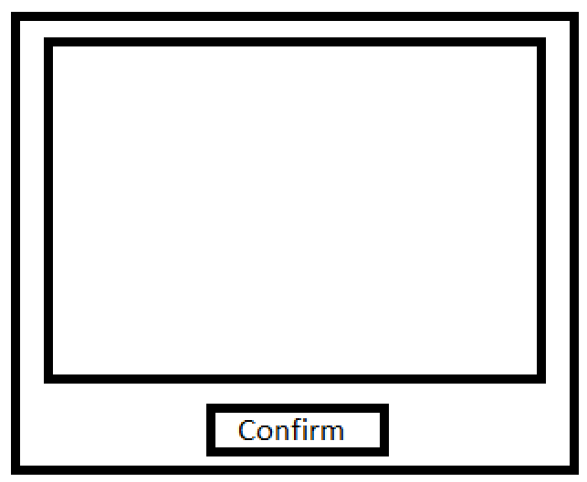

# Machine Learning: Alphabet Recognizer

### Introduktion

Vi har besluttet at lave et program, hvor brugeren skal tegne et bogstav, så skal Aien gætte hvilket bogstav det er, 
derefter skal brugere give feedback på om det blev gættet korrekt eller forkert. 

### Programmet

Først får brugeren vidst en popup hvor der står ”Tegn venligst et bogstav inde i den markeret firkanten”
derefter bliver boksen nedenunder vidst frem til brugeren

De skal derefter klik confirm. Så får de vidst en popup, som spørger ”gætted vores AI Knud rigtigt?”
og så får de ”yes” ”no” som mulighed. Ideen var så at træne Aien med det som vi tegned,
så den kan gætte mere rigtig i fremtiden. Lige nu gætter den 97% rigtigt.
Når man siger ”yes” så bliver filen gemt med det bogstav den gætted som navn på filen, og timestamp.
”L-170255875” – og det er Unix timestamp.

### Dataset

Vi har valgt at bruge datasættet fra huggingface som gør brug af det engelske alphabet,
men kun uppercase. Datasetet hedder ”pittawat/letter_recognition”.
Drømmen var at få muligheden for at append vores tegning til datasetet, så vi selv kunne træne modelen også,
men det nåede vi ikke 100% frem med. (dataset: https://huggingface.co/datasets/pittawat/letter_recognition)

### Algorithm

Vi træner vores model ved brug af supervised learning, da vores datasæt er beregnet til dette formål.
Derudover vil vores viderebygning på datasættet blive gemt i samme format,
så vi kan træne videre på modellen uden besvær.
Vores model er opbygget som et sequentielt neuralt net, hvor vi tilføjer forskellige 8 lag.

### Konklusion

    1. Problemet kunne ikke løses bedre/nemmere uden Machine Learning.
        Begrundelsen for dette er dog at vi ikke helt ved hvor vi skal starte uden en AI. Men som forklaring,
        folk tegner forskelligt og en AI lære jo over tid. 
    2. Jeg vil ikke mene det var særlig komplex, men det kunne man jo nemt gøre det.
        Man kunne jo lave det bedre, hvis man lavede det til at Aien ville skrive en text for dig hvis du tegnede det.
    3. Modellen kunne forbedres ved at vi kunne træne den selv,
        hvis vi nu kunne append vores svar til modellen hvergang den havde ret,
        så ville den også blive trænet. Dette nåede vi dog ikke at lave.
